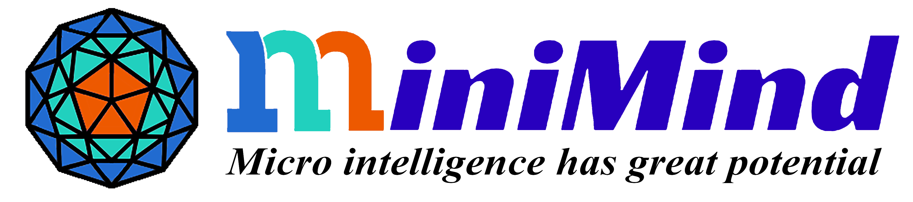
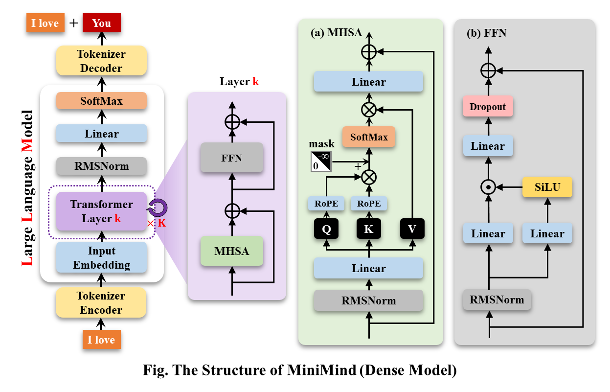
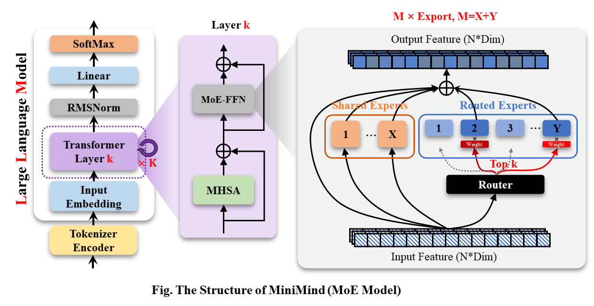

<div align="center">



</div>


* 该项目构建了一个大模型极简结构，数据集清洗和预处理、监督预训练(Pretrain)、有监督指令微调(SFT)、低秩自适应(LoRA)
  微调，无奖励强化学习直接偏好对齐(DPO)的全阶段代码，也包含拓展共享混合专家(MoE)的稀疏模型；
* 这不仅是一个开源模型Llama的简洁实现，也是入门大语言模型（LLM）的教程。
* 参考项目: [MiniMind](https://github.com/jingyaogong/minimind)。

___

# 📌 Introduction

大语言模型（LLM）领域，如 GPT、LLaMA、GLM 等，虽然它们效果惊艳，
但动辄10 Bilion庞大的模型参数个人设备显存远不够训练，甚至推理困难。
几乎所有人都不会只满足于用Lora等方案fine-tuing大模型学会一些新的指令，
这约等于在教牛顿玩21世纪的智能手机，然而，这远远脱离了学习物理本身的奥妙。
此外，卖课付费订阅的营销号漏洞百出的一知半解讲解AI的教程遍地，
让理解LLM的优质内容雪上加霜，严重阻碍了学习者。

因此，本项目的目标是把上手LLM的门槛无限降低，
直接从0开始训练一个极其轻量的语言模型。


# 📌 Environment

仅是我个人的软硬件环境配置，自行酌情更改：

```bash
CPU: Intel(R) Core(TM) i9-10980XE CPU @ 3.00GHz
内存：16 GB
显卡：NVIDIA GeForce RTX 3050(4GB)
环境：python 3.10 + Torch 2.1.2 + DDP单机多卡训练
```

* Ubuntu == 20.04
* Python == 3.10
* Pytorch == 2.1.2
* CUDA == 11.8
* [requirements.txt](./requirements.txt)

# 📌 Quick Start Test


# 📌 Data sources


# 📌 Model

MiniMind-Dense（和[Llama3.1](https://ai.meta.com/blog/meta-llama-3-1/)一样）使用了Transformer的Decoder-Only结构，跟GPT-3的区别在于：

* 采用了GPT-3的预标准化方法，也就是在每个Transformer子层的输入上进行归一化，而不是在输出上。具体来说，使用的是RMSNorm归一化函数。
* 用SwiGLU激活函数替代了ReLU，这样做是为了提高性能。
* 像GPT-Neo一样，去掉了绝对位置嵌入，改用了旋转位置嵌入（RoPE），这样在处理超出训练长度的推理时效果更好。

---

MiniMind-MoE模型，它的结构基于Llama3和[Deepseek-V2](https://arxiv.org/pdf/2405.04434)中的MixFFN混合专家模块。

* DeepSeek-V2在前馈网络（FFN）方面，采用了更细粒度的专家分割和共享的专家隔离技术，以提高Experts的效果。

---

MiniMind的整体结构一致，只是在RoPE计算、推理函数和FFN层的代码上做了一些小调整。
其结构如下图：




修改模型配置见[./model/LMConfig.py](./model/LMConfig.py)。


# 📌 Experiment


1. **预训练(Text-to-Text)**:
    - LLM首先要学习的并非直接与人交流，而是让肚子中充满知识的墨水，至于墨水理论上喝的越饱越好，产生大量的对世界的认知积累。
    - 预训练就是让Model先埋头苦学大量基本的知识，例如从维基百科、新闻、常识、书籍等。
    - 它无监督的从大量的文本数据中压缩知识到自己模型的权重，目的是：学会词语接龙。例如我们输入“秦始皇是”四个字，它在大量学习后能预测出下一句话大概率是“中国的第一位皇帝”。
   > pretrain的学习率设置为1e-4到1e-5的动态学习率，预训练epoch数设为5。
    ```bash
    torchrun --nproc_per_node 2 1-pretrain.py
    ```

---
